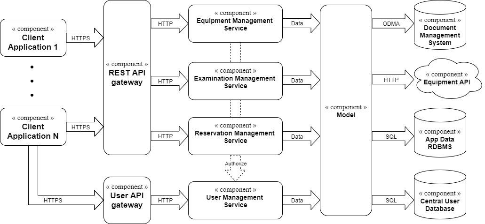

# Component and connector viewpoint #
## Overview ##
- krátký okec o čem to je

[PDF version](img/CnC.pdf)

## Data flow viewpoint ##
### Presentation ###

- **Web** **app** **clients** 
  - Users are connected to this part from web applications 

- **Equipments  view, Reservation view , Examination view** 
  - Handle requests to show specific pages 

- **Get** **data** **gateway** 
  - If web app sent request that needs data from database the gateway will pass the request to more distant part, waits for result and sends back to web app in one of the views 

- **Authenticate** **user gateway** 
  - If client from web app sent request for authenticate user the gateway will pass the request to more distant part, waits for result and behaves accordingly 

### Domain ###

- **User API** **Gateway** 
  - Accepts user request and translates them from JSON to function calls on **Data** **service**. Then encodes the response back to JSON and sends it to the client application. 

- **Data** **service** 
  - Creates responses to client requests. 
  - It uses **Model** to get the data and also **Authorization** **service** to verify the user has necessary rights to perform given request. In both cases the data are transferred via function calls. 

- **Authorization** **service** 
  - Uses data from **Model** to authorizate and authenticate users. Again, this is done via function calls. 

- **Model** 
  - Presents consistent and comprehensive model of all the data required by the other services. 
  - It doesn’t have the actual data in its memory. It uses **Data** **Providers** to get them or to update them instead. 

### Data Access ###

- **RDBMS (for application data)** 
  - The relational database is used to store application data. This component is called by the Connector component, or directly in case of Reservation Management System, by SQL queries.  

- **Document** **Menegement** **System** 
  - The document database is used to store whole examinations (including images, diagrams etc). This component is called by the Connector by the specific protocol. 

- **Equipment** **API** 
  - The Equipment API is used in case when data are stored directly on the equipment. This component is called by the Connector by HTTP requests. 

- **RDBMS (for users data)** 
  - The relational database is used to store users data. This component is called by SQL queries. 