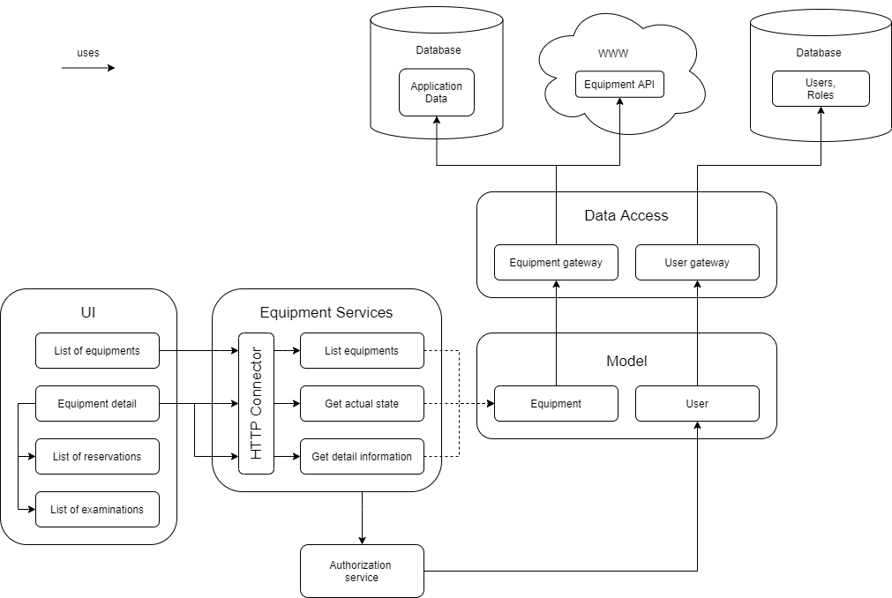
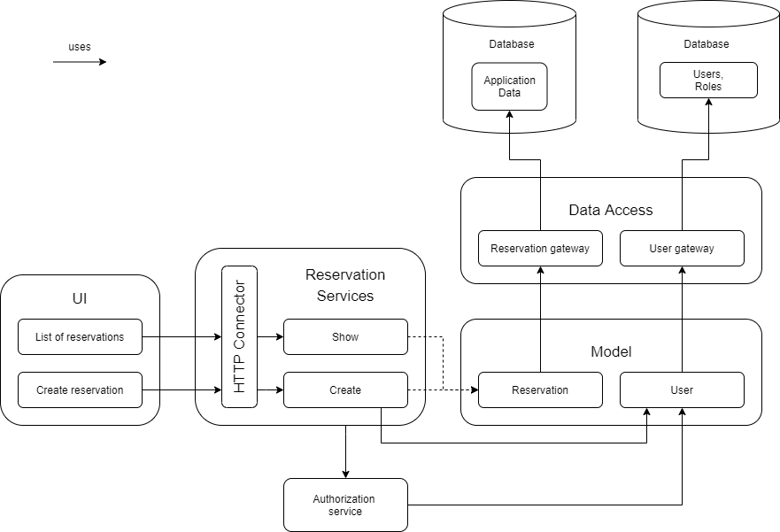
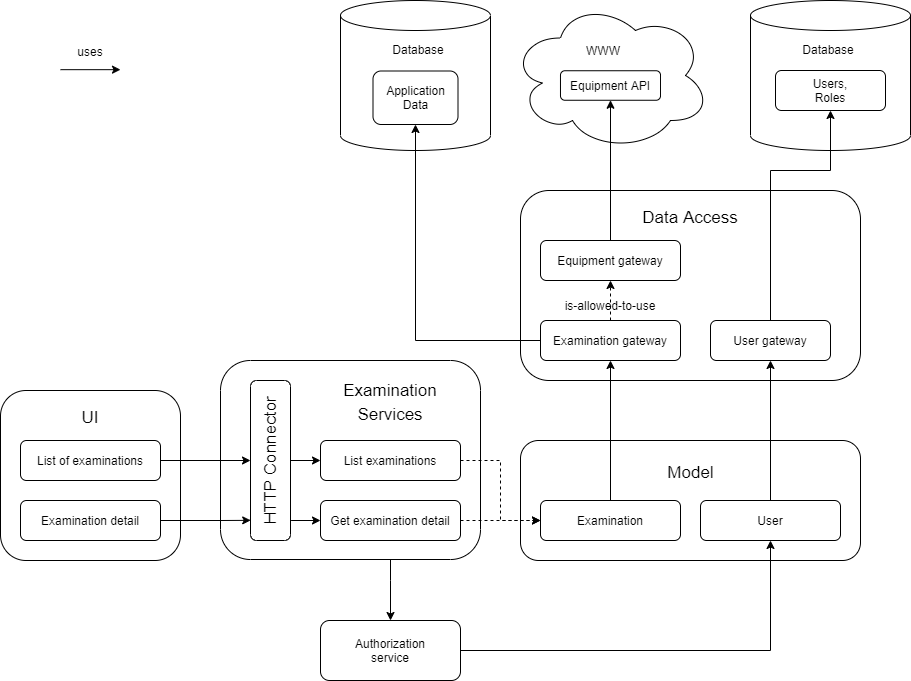

# Module viewpoint #
## Overview ##
- krátký okec o čem to je

## Decomposition viewpoint ##
### Presentation ###

- Presentation submodule contains different views user would want to see when using this application: 
  - **List of equipments** 
  - **Equipment** **detail** 
  - **List of** **reservations** on specified equipment 
  - **Create** **reservations** 
    - User needs API for creating new reservation 
  - **List of examinations** on specified equipment 
  - **Examination Detail** 
  - **Authentication** 
    - User needs to authenticate yourself to have access to views above 

### Domain ###

- This module processes the requests from users, performs database updates and creates responses for users 

- It is divided to **Services** and **Model** sumbodules: 
  - **Model** is used as a structure for an easy access to data for **S****ervices** 
  - It has the following submodules: 
    - **Equipment** - represents the current state of equipment 
    - **Reservation** - list of reservations on the equipment 
    - **Examination** - list of examinations which were made on the equipment 
    - **User** - data for user authentication and authorization 
  - **Services** processes user requests and updates **Model** accordingly 
  - It consists of: 
    - **Authorization** **service** - it is used by every other service to authorize and authenticate the user who performs the request 
    - **Equipment** **services**: 
      - **Equipmnent** **API** - handles the connection to the **Presentation** 
      - **List** **equipments** 
      - **Get actual state** 
      - **Get detail** **information** 
    - **Reservation** **services****:** 
    - **Reservation** **API** - handles the connection to the **Presentation** 
      - **Show** 
      - **Create** 
    - **Examination** **services****:** 
      - **Examination** **API** - handles the connection to the **Presentation** 
      - **List examinations** 
      - **Get examination detail** 

### Data Access ###

## Usage viewpoint ##

For greater clarity, we split the usage viewpoint into three more detailed parts.

### Equipment ###

[PDF version](img/EquipmentUsageViewpoint.pdf)

This viewpoint shows dependencies among modules used when the user wants to get data related to the equipment.

Submodules from the UI module use the Equipment Services module, specifically the HTTP connector submodule which after ~~?calls or uses?~~ List equipments, Get actual state or Get detail information submodules. Those submodules then use the Equipment submodule in the Model module, which in turn uses the Equpment gateway submodule in the Data Access module. Equipment Services module also uses the Authorization service module, which then uses the User module. 

> Information about the user can be recieved from the database containing data about users (e.g. user credentials). Information about the equipment can be recieved from the database containing data about equipment. In case when data about the related equipment is not in the database, the Data Access submodule can request them directly from the application via Equipment API.

### Reservation ###

[PDF version](img/ReservationUsageViewpoint.pdf)

This viewpoint shows dependencies among modules used when the user wants to get data related to the reservations. It has basically the same structure as the viewpoint above. 

Submodules from the UI module use the Reservation Services module, specifically the HTTP connector submodule which after ~~?calls or uses?~~ Show or Create submodules, which then use the Reservation submodule in the Model module, which in turn uses the Reservation gateway submodule in the Data Access module. The Create module also ~~"is-allowed-to-use" or uses~~ the User submodule in the Model module (because the reservations are created for specific users). Reservation Services module also uses the Authorization service module, which then uses the User module.

> The Reservation Services provides two functions – one which shows current reservations for given equipment and another which allows the creation of new reservations 
> The Create service is also the only one which directly interact with the User model because the reservations are created for specific users. 

### Examination ###

[PDF version](img/ExaminationUsageViewpoint.pdf)

This viewpoint shows dependencies among modules used when the user wants to get data related to the examinations. 

Submodules from the UI module use the Examination Services module, specifically the HTTP connector submodule which after ~~?calls or uses?~~ List examinations, Get or Get examination detail submodules. Those submodules then use the Examination submodule in the Model module, which in turn uses the Examination gateway submodule, which "is-allowed-to-use" the Equipment gateway (in the case when data are not found in the database). Examination Services module also uses the Authorization service module, which then uses the User module. 

> Public API sends request to appropriate examination service. Services work with model for examination and user through an Authorization service. User information will be got through user gateway from external database. Examination data will be got through examination gateway from application database. If examination detail cannot be yet found in the application database, data access layer will connect to Equipment API through Equipment gateway. 
